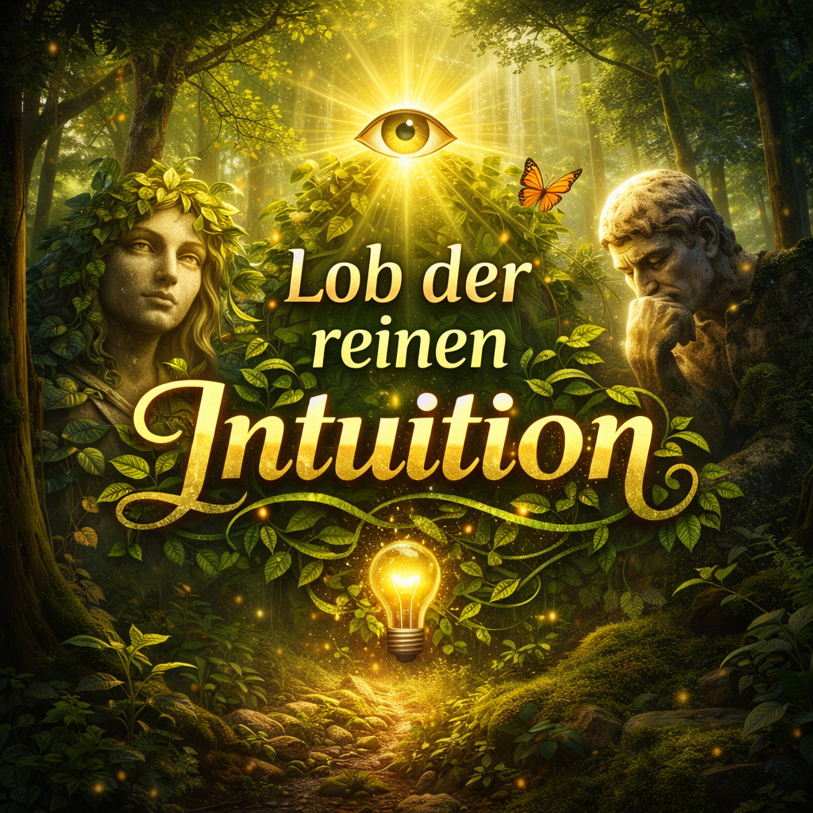

# [Anjunar - Lob der reinen Intuition (Click)](<anjunar/README.md>)

## Kurzbeschreibung

Dieses Projekt versammelt die Texte von „Lob der reinen Intuition“ als offene Sammlung philosophischer, spiritueller und poetischer Reflexionen. Es ist kein systematisches Lehrbuch, sondern ein Archiv von Momentaufnahmen: Beobachtungen über Sein, Bewusstsein, Liebe, Kosmologie und gesellschaftliche Dynamik. Die Texte entstehen aus einer Haltung, die Intuition als eigenständigen Erkenntnisweg ernst nimmt. Sie suchen nicht die endgültige Theorie, sondern wollen die Grenze zwischen Sprache und Erfahrung ausloten und zeigen, wie innere Einsichten Form annehmen können.

Der Leser begegnet einem Denken, das präzise sein will, ohne sich in Argumentation zu erschöpfen. Viele Kapitel arbeiten mit Bildern, Gleichnissen oder verdichteten Sätzen; andere entfalten klare Linien, die auf eine gemeinsame Mitte zulaufen. Diese Mitte ist das Vertrauen, dass Wirklichkeit mehr ist als das Messbare und dass Liebe, Bewusstsein und Wahrheit sich gegenseitig bedingen. Das Inhaltsverzeichnis ordnet die Texte thematisch und lädt ein, linear zu lesen oder in einzelne Pfade einzutauchen. Wer diese Sammlung öffnet, betritt keinen Lehrpfad, sondern einen Raum der Resonanz, in dem Fragen, Einsichten und Stille nebeneinander stehen.

Die Sektionen führen von Ursprung und Absolutem über Kosmologie und Psyche bis zu Ethik, Ritualen und Zeitdiagnosen. Jede Rubrik besitzt ein Startkapitel, das den Einstieg erleichtert, und verzweigt dann in spezifische Blickwinkel. So entsteht eine Landkarte, die sowohl meditative Lektüre als auch gezielte Suche ermöglicht.

# Der Raum der Müdigkeit
Es beginnt nicht mit einem Fall.
Es beginnt mit einem Erschöpfen.

Noch bevor ein Mensch ein Name wird, ein Körper, eine Geschichte, ist da etwas, das lange getragen hat.
Zu lange vielleicht.
Eine Seele, die nicht gebrochen ist, sondern übervoll.
Nicht verloren, sondern müde vom Unendlichen.

Müdigkeit ist hier kein Zustand.
Sie ist ein Zeichen.
Ein Abdruck der Ewigkeit im Endlichen.

Denn wer unendlich war, der kennt keine Schuld.
Aber er kennt das Gewicht der Weite.
Er kennt die Überfülle des Wissens, das keinen Rand hat.
Er kennt die Klarheit, die keinen Schatten duldet.
Er kennt die Verantwortung, die kein Ende kennt.

Und irgendwann – niemand weiß wann – wird selbst das Licht schwer.

Vielleicht beginnt Inkarnation genau dort:
nicht als Strafe, sondern als Erlaubnis, endlich einmal nicht alles halten zu müssen.
Als Einladung, sich zu legen.
Als Pause zwischen zwei Unendlichkeiten.

Müdigkeit ist dann nicht das Gegenteil von Kraft.
Sie ist der Beweis, dass Kraft lange genug da war.

Sie ist die Falte im Bewusstsein, die sagt:
Ich habe genug gesehen. Lass mich für eine Weile vergessen.  
Nicht aus Schwäche.
Aus Würde.

Denn wer müde ist, hat nicht versagt.
Wer müde ist, hat getragen.
Wer müde ist, hat geliebt.
Wer müde ist, hat gehalten, was größer war als er selbst.

Der Schlaf, den die Seele sucht, ist kein Dunkel.
Er ist ein Schutz.
Eine Decke über einem Feuer, das sonst alles verbrennen würde.

Vielleicht ist das der erste Akt des Menschwerdens:
dass eine unendliche Seele sich selbst erlaubt, endlich einmal klein zu sein.
Endlich einmal begrenzt.
Endlich einmal nicht alles zu wissen.
Endlich einmal nicht alles zu müssen.

Müdigkeit ist dann nicht das Ende.
Sie ist der Anfang.
Der erste Atemzug einer Seele, die sich in Fleisch legt, um sich selbst nicht zu verlieren.

Und so beginnt das Leben nicht mit einem Schrei.
Es beginnt mit einem Loslassen.
Mit einem Sich‑Hinlegen in die Welt.
Mit einer heiligen Erschöpfung, die sagt:

Ich darf ruhen.
Ich darf vergessen.
Ich darf Mensch sein.

# Der Raum der Tiefe
Tiefe beginnt nicht dort, wo etwas verstanden wird.
Tiefe beginnt dort, wo etwas nicht mehr ausweicht.

Es ist der Moment, in dem das Leben aufhört, höflich zu sein.
In dem es nicht mehr fragt, ob du bereit bist.
In dem es dich nicht mehr schont.

Tiefe ist das, was bleibt, wenn alle Oberflächen versagen.

Sie kommt nicht als Gedanke.
Sie kommt als Erschütterung.
Als ein inneres Beben, das keine Ursache hat, weil es älter ist als jede Geschichte.

Manchmal ist Tiefe ein Verlust.
Manchmal ein Blick.
Manchmal ein Wort, das zu wahr ist, um gehört zu werden.
Manchmal ein Schweigen, das zu groß ist, um ertragen zu werden.

Tiefe ist nicht romantisch.
Sie ist nicht schön.
Sie ist nicht erhaben.

Sie ist das, was geschieht, wenn das Leben sich selbst zeigt –
ohne Maske, ohne Erklärung, ohne Rücksicht.

Tiefe ist der Moment, in dem du spürst,
dass du nicht nur ein Mensch bist,
sondern ein Wesen, das zu viel gesehen hat,
um jemals wieder ganz leicht zu werden.

Sie ist das Gewicht der Bedeutung.
Das Gewicht der Liebe.
Das Gewicht der Vergänglichkeit.
Das Gewicht der Bindung.
Das Gewicht der Wahrheit.

Tiefe ist das, was in dir bleibt,
wenn jemand geht, der nicht hätte gehen dürfen.
Wenn etwas zerbricht, das du nicht halten konntest.
Wenn du spürst, dass Verlust kein Ereignis ist,
sondern eine Landschaft, in der du plötzlich wohnst.

Tiefe ist der Kontinent, der sich unter deinem Leben verschiebt.

Sie fragt nicht nach Schuld.
Sie fragt nicht nach Sinn.
Sie fragt nicht nach Zustimmung.

Sie ist einfach da.
Groß.
Stumm.
Unverhandelbar.

Und doch –
in dieser Wucht liegt etwas, das größer ist als Schmerz.
Etwas, das nicht zerstört, sondern erinnert.

Denn Tiefe ist nicht das Gegenteil von Leichtigkeit.
Tiefe ist die Bedingung dafür, dass Leichtigkeit überhaupt Bedeutung haben kann.

Tiefe ist der Raum, in dem du erkennst,
dass du nicht zerbrichst,
sondern weiter wirst.

Dass du nicht untergehst,
sondern tiefer wirst als dein eigenes Leid.

Dass du nicht verloren bist,
sondern geöffnet.

Tiefe ist der Ort, an dem der Mensch aufhört,
nur seine Biografie zu sein.

Und beginnt, wieder Seele zu werden.

# Der Raum der Rückkehr
Es gibt einen Moment, der nicht laut ist.
Kein Blitz, kein Ruf, kein Zeichen.
Nur ein kaum spürbares Beben,
wie das erste Zittern eines Vogels, der sich erinnert, dass er Flügel hat.

Rückkehr beginnt leise.
Sie beginnt dort, wo die Müdigkeit nicht mehr nur Schutz ist,
sondern zu eng wird.
Wo das Vergessen nicht mehr trägt,
weil etwas in dir wieder atmen will.

Es ist kein Erwachen im üblichen Sinn.
Es ist kein Triumph.
Keine Erleuchtung.
Keine Krone für die Spirituellen.

Rückkehr ist der Moment,
in dem die Seele genug Kraft gesammelt hat,
um sich selbst wieder auszuhalten.

Zuerst kommen die Risse.
Die feinen.
Die, die man nur spürt, wenn man still ist.
Ein Unbehagen, das nicht weh tut,
aber auch nicht schweigt.
Ein Gefühl, dass die Oberfläche nicht mehr reicht,
dass das Gewohnte nicht mehr passt,
dass das Leben zu klein geworden ist für das, was in dir drängt.

Dann kommt die Unruhe.
Nicht die nervöse,
sondern die heilige.
Die, die sagt:
Da ist mehr.
Da war immer mehr.
Und du weißt es.

Und irgendwann –
niemand weiß wann –
öffnet sich etwas in dir,
das nicht neu ist,
sondern uralt.
Ein Wissen, das nicht gelernt wurde,
sondern gewartet hat.
Ein Licht, das nicht kommt,
sondern zurückkehrt.

Rückkehr ist kein Schritt nach vorn.
Sie ist ein Schritt nach innen.
Ein Wiederfinden.
Ein Wiedererkennen.
Ein Wiederwerden.

Es ist der Moment,
in dem du spürst,
dass du größer bist als deine Biografie.
Dass du nicht nur dieses Leben bist,
sondern die Summe aller Leben,
die in dir ruhen wie Schichten eines alten Baumes.

Rückkehr ist das Ende der heiligen Amnesie.
Nicht abrupt.
Nicht gewaltsam.
Sondern wie Schnee, der schmilzt.
Wie Nebel, der sich hebt.
Wie ein Name, der dir plötzlich wieder einfällt,
obwohl du ihn nie wirklich vergessen hast.

Und mit der Rückkehr kommt nicht nur Licht.
Es kommt Last.
Es kommt Verantwortung.
Es kommt Wahrheit.

Denn wer zurückkehrt,
kehrt nicht nur zur Schönheit zurück.
Er kehrt zur Größe zurück.
Zur Tiefe.
Zur Weite.
Zu dem, was er immer war,
aber lange nicht tragen konnte.

Rückkehr ist kein Geschenk.
Sie ist ein Wiedererlangen.
Ein Zurücknehmen dessen,
was du einst abgelegt hast,
um Mensch sein zu können.

Und doch –
in dieser Rückkehr liegt eine stille Freude.
Nicht die laute,
nicht die ekstatische,
sondern die,
die sagt:

Ich bin wieder da.
Nicht neu.
Nicht verändert.
Nur erinnert.