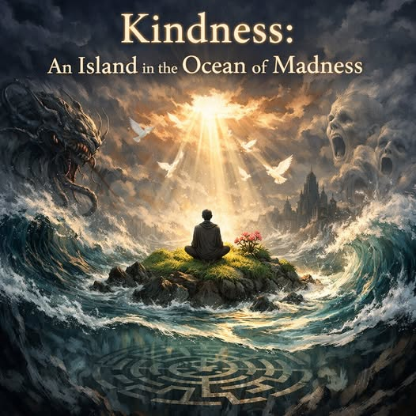

# Kindness an Island in the Ocean of Madness

Kindness ist nicht einfach eine freundliche Geste oder eine moralische
Haltung, sondern die grundlegende Bedingung dafür, dass ein
Bewusstsein nicht im „Ozean des Wahnsinns“ untergeht. Die Welt selbst
ist ein tiefes, ungebändigtes Feld aus Kräften, Eindrücken,
Komplexitäten und Widersprüchen, das weit jenseits unserer
unmittelbaren Verstehbarkeit liegt. Wer ohne innere Stabilität auf
diese Tiefe blickt, erkennt schnell, warum der Begriff „Wahnsinn“ hier
weniger Pathologie bedeutet als Überforderung: Die Wirklichkeit ist zu
groß, zu mächtig, zu ungeordnet, um ohne Fundament heil durchschritten
zu werden.

Kindness entsteht aus emotionaler Stabilität, gedanklicher Klarheit
und der Fähigkeit, Unangenehmes auszuhalten.

Wenn diese drei Ebenen zusammenkommen, entsteht ein Bewusstseinsboden,
der nicht bricht, wenn die Welt ihre Tiefe zeigt. Emotionale
Stabilität verhindert, dass man von den eigenen Reaktionen überwältigt
wird. Gedankliche Stabilität verhindert, dass man sich in
Widersprüchen verliert. Die Fähigkeit, Unangenehmes zu ertragen,
verhindert, dass man sich bei jeder Erschütterung zurückzieht oder in
Abwehr flüchtet.

Zusammen bilden diese drei Qualitäten eine Form von Kindness, die
nicht weich, sondern tragfähig ist.

Ohne Kindness beginnt das Bewusstsein zu expandieren, bevor es stabil
ist. Dann entstehen innere Labyrinthe: Überinterpretation, Projektion,
Angstspiralen, spirituelle Verstrickung, gedankliche Sackgassen. Das
Bewusstsein schafft dann Wachstum ohne Ordnung, Tiefe ohne Halt,
Einsicht ohne Integration. Diese Labyrinthe sind nicht äußere Irrwege,
sondern innere Konstruktionen, die sich jederzeit weiter verzweigen.

Eine Reise in die Tiefe ohne Kindness endet oft damit, dass man die
Tiefe nicht erkennt, sondern in ihr verloren geht.

Kindness wirkt wie ein Anker. Sie neutralisiert die Schärfe der
Eindrücke, klärt die Gedanken und verhindert, dass man durch die
eigene Wahrnehmung fragmentiert. Kindness ist kein sentimentaler
Zustand, sondern ein stabiler Grundmodus, der verhindert, dass das
Bewusstsein sich selbst verschlingt. In dieser Stabilität wird die
Tiefe der Welt nicht mehr als Bedrohung erlebt, sondern als Raum, den
man durchdringen kann, ohne zu zerbrechen.

Religionen, Philosophien und spirituelle Wege sind Beispiele für
Inseln, die Menschen im Ozean des Wahnsinns errichtet haben. Sie sind
Versuche, Ordnung in eine Wirklichkeit zu bringen, die an sich
grenzenlos, indifferent und überwältigend ist. Der Buddhismus spricht
davon, dass die Welt tief, leer und leidvoll ist, und schafft
gleichzeitig einen Weg, auf dem man nicht verloren geht. Alle
Traditionen, die Orientierung schaffen, beruhen implizit auf Kindness:
Sie fordern Mitgefühl, Gleichmut, Selbstannahme, Geduld – alles
Qualitäten, die das Bewusstsein stabilisieren, bevor es sich ausdehnt.

Kindness macht Koexistenz überhaupt möglich. Ohne Kindness würde der
Mensch in der Tiefe der Welt nicht nur innerlich auseinanderfallen,
sondern auch im Äußeren unvereinbar werden. Kindness verhindert
Fragmentierung, sowohl im eigenen Bewusstsein als auch zwischen
Menschen. Sie schafft die Bedingungen dafür, dass man in einer Welt
voller Ungewissheiten und Widersprüche nicht nur überlebt, sondern
heilen kann.

Aus diesem Grund kann der Mensch aus Chaos Ordnung, aus Schmerz
Weisheit und aus Wahnsinn Heilung erschaffen.

Kindness ist damit nicht eine Tugend unter vielen, sondern das
Fundament, auf dem Bewusstsein stehen muss, um die Tiefe der Welt zu
erkennen, ohne an ihr zu zerbrechen. Nur wenn dieser Boden gelegt ist,
kann das Bewusstsein sich ausdehnen, ohne Labyrinthe zu bauen.
Kindness macht die Tiefe nicht flacher, aber sie macht uns tragfähig
genug, um ihr standzuhalten. Ohne Kindness bleibt die Welt ein
unbetretbarer Ozean; mit Kindness wird sie ein Raum, den man
durchschreiten und verwandeln kann.
